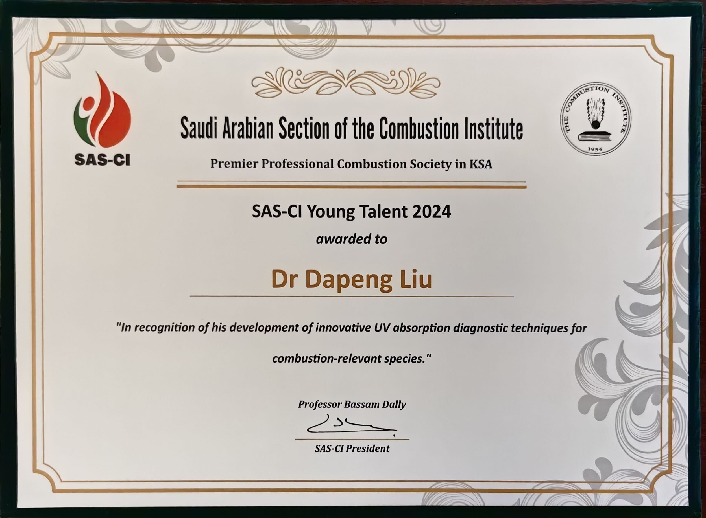
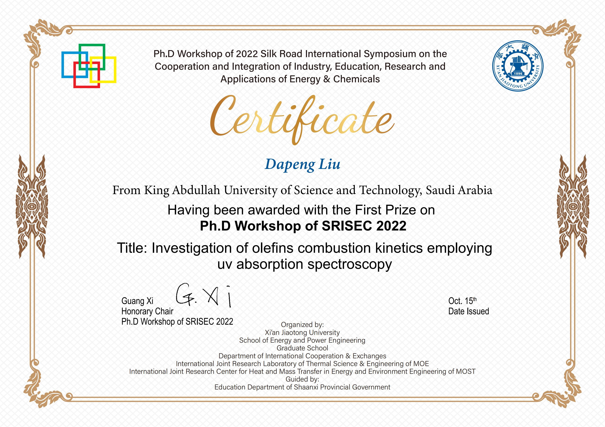
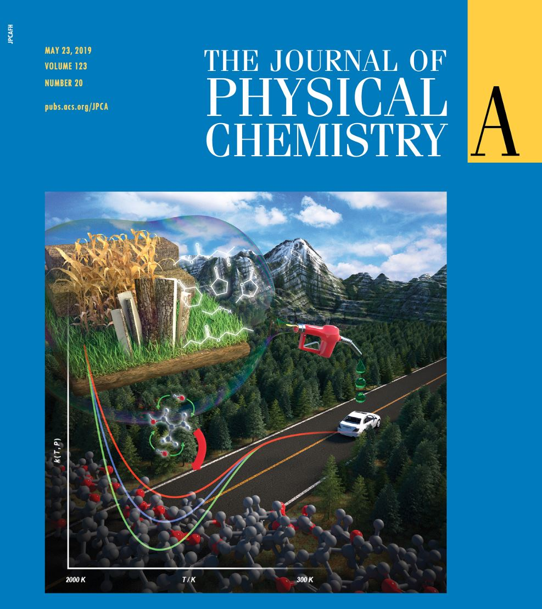

<link rel="stylesheet" href="styles.css" type="text/css">

<h1 id="about">About Him</h1>

Dr. Dapeng Liu is currently a Postdoctoral Fellow at KAUST and previously served as a Postdoctoral Research Associate at CUHK. He has been awarded the prestigious [Bernard Lewis Fellowship](https://www.combustioninstitute.org/bernard_lewis_fellowship.php) at the 39th International Symposium on Combustion (Vancouver, August 2022).He served as a session chair at the 40th Proceedings of the Combustion Institute (Milano, July 2024), and received the SAS-CI Young Talent award as the inaugural awardee (Jeddah, Nov 2024). 

Dapeng has developed innovative UV absorption diagnostic for multiple species. Under combustion conditions, where absorption spectra are typically ten times weaker than at room temperature, these diagnostics achieved impressive detection limits (ppm level) with sub-microsecond time resolution. These advancements have significantly enhanced the fidelity of kinetic measurements across various levels.

(1)	Species Time-Histories: Serve as validation targets for kinetic models and markers of flame or ignition.

(2)	Overall Rate Coefficients: Encompass various reaction types (radical reactions, concerted elimination reactions, unimolecular reactions, and bimolecular reactions), test conditions (oxidation and pyrolysis), and fuel types (conventional, bio-derived, low carbon, and carbon-free fuels).

(3)	Branching Ratios: Pioneered three methodologies for measuring branching ratios, including deuterated molecules, isotopic labeling, and key product methods.

(4)	Rate Rules: Addressing the challenge of kinetic measurements for large molecules and the needs of automatic kinetic modeling studies, rate rules were measured for three reaction classes using sensitive UV absorption diagnostics. These include OH + alkanes reactions, thermal decomposition of alkenes, and OH + alkenes. These rate rules enhance the predictive accuracy of existing literature models and facilitate automatic modeling studies.

Spectroscopy illustrates the ambiguous pathway of energy conversion:

You can find his CV [here](files/Dapeng_resume_Nov_2024.pdf).

<h1 id="pub"> Publications</h1>

  Jump to year: &nbsp;
  <a href="#2025">2025</a>,&nbsp;
  <a href="#2024">2024</a>,&nbsp;
  <a href="#2023">2023</a>,&nbsp;
  <a href="#2022">2022</a>,&nbsp;
  <a href="#2021">2021</a>,&nbsp;
  <a href="#2020">2020</a>,&nbsp;
  <a href="#2019">2019</a>,&nbsp;
  <a href="#2018">2018</a>,&nbsp;
  <a href="#2017">2017</a>.

<h3 id="2025"> 2025</h3> 

[<i class="fa fa-file-pdf"></i> ](https://www.sciencedirect.com/science/article/pii/S0010218025001117)
**Investigation of Cyclopentyl Ring-Opening β-Scission Reaction**
 

<u>Dapeng Liu</u>, Aamir Farooq#
 

*Combustion and Flame, 2025*
 

[<i class="fa fa-file-pdf"></i> ](https://www.sciencedirect.com/science/article/pii/S0016236125000250)
**Investigation of 1, 3-Pentadiene thermal decomposition**
 

<u>Dapeng Liu</u>, Aamir Farooq#
 

*Fuel, 2025*
 

[<i class="fa fa-file-pdf"></i> ](https://www.sciencedirect.com/science/article/pii/S0010218024005583)
**Empirical Rate Rules for Hydroxyl Radical Reactions with Alkenes**
 

<u>Dapeng Liu</u>, Aamir Farooq#
 

*Combustion and Flame, 2025*
 

<h3 id="2024"> 2024</h3> 

[<i class="fa fa-file-pdf"></i> ](https://www.sciencedirect.com/science/article/pii/S0010218024003274)
**Thermal decomposition of alkenes: role of allylic C-C bond cleavage**
 

<u>Dapeng Liu</u>, Aamir Farooq#
 

*Combustion and Flame, 2024*
 

[<i class="fa fa-file-pdf"></i> ](https://www.sciencedirect.com/science/article/pii/S1540748924001202)
**Heptanone isomers as a biofuel: Reactivity with OH radicals**
 

<u>Dapeng Liu</u>, Fethi Khaled, Aamir Farooq#
 

*Proceedinngs of the Combustion Institue, 2024*
 

[<i class="fa fa-file-pdf"></i> ](https://www.sciencedirect.com/science/article/pii/S0010218024002013)
**Investigation of Cyclopentene + OH and Cyclopentene Thermal Decomposition Reactions**
 

<u>Dapeng Liu</u>, Fethi Khaled, Wei Ren, Aamir Farooq#
 

*Combustion and Flame, 2024*
 

[<i class="fa fa-file-pdf"></i> ](https://www.sciencedirect.com/science/article/pii/S0010218023006636)
**Allylic-alkylic C-C bond decomposition in 1-butene and 1-pentene**
 

 Chengyu Zhou, <u>Dapeng Liu#</u>, Aamir Farooq#
 

*Combustion and Flame, 2024*
 

[<i class="fa fa-file-pdf"></i> ](https://www.sciencedirect.com/science/article/pii/S0010218024000312)
**A theoretical and experimental study of 2-ethylfuran+ OH reaction**
 

 Li Fu, <u>Dapeng Liu</u>,... , Hongbo Ning#, Wei Ren#, Aamir Farooq
 

*Combustion and Flame, 2024*
 

<h3 id="2023"> 2023</h3> 

[<i class="fa fa-file-pdf"></i> ](https://www.sciencedirect.com/science/article/pii/S0010218023001554)
**Gamma-valerolactone (GVL) as a biofuel: Investigation of GVL thermal decomposition and GVL+ OH reaction**
 

 <u>Dapeng Liu</u>, Aamir Farooq
 

*Combustion and Flame, 2023*
 

[<i class="fa fa-file-pdf"></i> ](https://www.sciencedirect.com/science/article/pii/S0010218022005077)
**Reaction kinetics for high pressure hydrogen oxy-combustion in the presence of high levels of H2O and CO2**
 

Ashkan Beigzadeh, ... ,<u>Dapeng Liu</u>, ..., Aamir Farooq
 

*Combustion and Flame, 2023*
 

[<i class="fa fa-file-pdf"></i> ](https://www.sciencedirect.com/science/article/abs/pii/S0010218023002286)
**Investigation of thermal decomposition of nitrobenzene: An energetic material**
 

 <u>Dapeng Liu</u>, Aamir Farooq
 

*Combustion and Flame, 2023*
 

<h3 id="2022"> 2022</h3> 

[<i class="fa fa-file-pdf"></i> ](https://www.sciencedirect.com/science/article/pii/S0010218022004540)
**Investigation of cyclohexene thermal decomposition and cyclohexene + OH reactions**
 

 <u>Dapeng Liu</u>, Aamir Farooq
 

*Combustion and Flame, 2022*
 

[<i class="fa fa-file-pdf"></i> ](https://www.sciencedirect.com/science/article/pii/S1540748922000943)
**Reaction kinetics of OH radicals with 1, 3, 5-trimethyl benzene: An experimental and theoretical study**
 

 <u>Dapeng Liu</u>, Binod R. Giri,Tam V-T. Mai,Lam K. Huynh, Aamir Farooq
 

*Proceedings of the Combustion Institute, 2022*
 

[<i class="fa fa-file-pdf"></i> ](https://www.sciencedirect.com/science/article/pii/S1540748922001006)
**Investigation of the kinetics of conjugated diolefins using UV absorption spectroscopy**
 

 <u>Dapeng Liu</u>, Aamir Farooq
 

*Proceedings of the Combustion Institute, 2022*
 

[<i class="fa fa-file-pdf"></i> ](https://pubs.rsc.org/en/content/articlehtml/2022/cp/d2cp00737a)
**The effect of hydrogen bonding on the reactivity of OH radicals with prenol and isoprenol**
 

Samah Y. Mohamed,  M. Monge-Palacio,Binod Giri, Fethi Khaled, <u>Dapeng Liu</u>, Aamir Farooq, S. Mani Sarathy
 

*Physical Chemistry Chemical Physics, 2022*
 

<h3 id="2021"> 2021</h3> 

[<i class="fa fa-file-pdf"></i> ](https://www.sciencedirect.com/science/article/pii/S0010218021002935)
**A comprehensive study on low-temperature oxidation chemistry of cyclohexane. II**
 

Jiabiao Zou, Hanfeng Jin, <u>Dapeng Liu</u>,Xiaoyuan Zhang, ... Aamir Farooq, Yuyang Li
 

*Combustion and Flame, 2021*
 

[<i class="fa fa-file-pdf"></i> ](https://pubs.acs.org/doi/full/10.1021/acs.energyfuels.1c01408)
**Symmetric ethers as bioderived fuels: Reactivity with OH radicals**
 

Myriam Belmekki, Binod Giri, <u>Dapeng Liu</u>, Aamir Farooq
 

*Energy & Fuels , 2021*
 

[<i class="fa fa-file-pdf"></i> ](https://www.sciencedirect.com/science/article/pii/S0010218020305368)
**First aromatic ring formation by the radical-chain reaction of vinylacetylene and propargyl**
 

Hanfeng Jin, Lili Xing, <u>Dapeng Liu</u>, Junyu Hao, Jiuzhong Yang, Aamir Farooq
 

*Combustion and Flame, 2021*
 

[<i class="fa fa-file-pdf"></i> ](https://www.sciencedirect.com/science/article/pii/S1540748920304247)
**On the Redox Reactions between Allyl Radicals and NOx**
 

<u>Dapeng Liu</u>, Milán Szőri, Béla Viskolcz, Et-touhamiEssbar, Binod Giri, Aamir Farooq
 

*Proceedings of the Combustion Institute, 2021*
 

[<i class="fa fa-file-pdf"></i> ](https://www.sciencedirect.com/science/article/pii/S1540748920303515)
**Kinetics and Thermochemistry of Cyclichexadienes Reactions with OH Radicals**
 

<u>Dapeng Liu</u>, Milán Szőri, Béla Viskolcz, Lam K. Huynh, Binod Giri, Aamir Farooq
 

*Proceedings of the Combustion Institute, 2021*
 

<h3 id="2020"> 2020</h3> 

[<i class="fa fa-file-pdf"></i> ](https://www.sciencedirect.com/science/article/pii/S1540748920304806)
**High Temperature Branching Ratio of Acetaldehyde + OH Reaction**
 

<u>Dapeng Liu</u>, Binod Giri, Aamir Farooq
 

*Proceedings of the Combustion Institute, 2020*
 

[<i class="fa fa-file-pdf"></i> ](https://www.sciencedirect.com/science/article/pii/S1540748920302509)
**A high temperature shock tube study of phenyl recombination reaction using laser absorption spectroscopy**
 

Hanfeng Jin, <u>Dapeng Liu</u>, Binod Giri,Aamir Farooq
 

*Proceedings of the Combustion Institute, 2020*
 

[<i class="fa fa-file-pdf"></i> ](https://www.sciencedirect.com/science/article/pii/S0010218020301176)
**Chemical kinetics of hydroxyl reactions with cyclopentadiene and indene**
 

Hanfeng Jin, <u>Dapeng Liu</u>, Jiabiao Zou,Junyu Hao,Can Shao, Mani Sarathy,Aamir Farooq
 

*Combustion and Flame, 2020*
 

[<i class="fa fa-file-pdf"></i> ](https://www.mdpi.com/1424-8220/20/12/3602)
**QCL-Based Dual-Comb Spectrometer for Multi-Species Measurements at High Temperatures and High Pressures**
 

Guangle Zhang, Raphael Horvath, <u>Dapeng Liu</u>, Markus Geiser, Aamir Farooq
 

*Proceedings of the Combustion Institute , 2020*
 

[<i class="fa fa-file-pdf"></i> ](https://www.sciencedirect.com/science/article/pii/S1540748920305095)
**A mid-infrared diagnostic for benzene using a tunable difference-frequency-generation laser**
 

Mohammad Khaled Shakfa, Mhanna Mhanna, Hanfeng Jin, <u>Dapeng Liu</u>,Khalil Djebbi,Marco Marangoni, Aamir Farooq
 

*Sensors , 2020*
 

<h3 id="2019"> 2019</h3> 

[<i class="fa fa-file-pdf"></i> ](https://pubs.acs.org/doi/10.1021/acs.jpca.9b00691)
**Cyclic Ketones as Future Fuels: Reactivity with OH Radicals (journal cover paper)**
 

<u>Dapeng Liu</u>, Binod Giri, Aamir Farooq
 

*The Journal of Physical Chemistry A , 2019*
 

[<i class="fa fa-file-pdf"></i> ](https://pubs.acs.org/doi/10.1021/acs.jpca.8b10997)
**Insights into the Reactions of Hydroxyl Radical with Diolefins from Atmospheric to Combustion Environments**
 

Fethi Khaled, Binod Giri, <u>Dapeng Liu</u>, Emmanuel Assaf, Christa Fittschen, Aamir Farooq
 

*The Journal of Physical Chemistry A, 2019*
 

<h3 id="2018"> 2018</h3> 

[<i class="fa fa-file-pdf"></i> ](https://www.sciencedirect.com/science/article/pii/S1540748918301858)
**A shock tube kinetic study on the branching ratio of methanol+ OH reaction**
 

<u>Dapeng Liu</u>, Binod Giri, Aamir Farooq
 

*Proceedings of the Combustion Institute, 2018*
 

[<i class="fa fa-file-pdf"></i> ](https://pubs.rsc.org/en/content/articlelanding/2018/cp/c8cp02075b#!divAbstract)
**A theoretical and shock tube kinetic study on hydrogen abstraction from phenyl formate**
 

Hongbo Ning, <u>Dapeng Liu</u>, Junjun Wu, Liuhao Ma, Wei Ren, Aamir Farooq
 

*Physical Chemistry Chemical Physics, 2018*
 

<h3 id="2017"> 2017</h3> 

[<i class="fa fa-file-pdf"></i> ](https://pubs.acs.org/doi/abs/10.1021/acs.jpca.6b10576)
**H-Abstraction by OH From Large Branched Alkanes: Overall Rate Measurements and Site-Specific Tertiary Rate Calculations**
 

<u>Dapeng Liu</u>, Fethi Khaled, Binod Giri, Emmanuel Assaf, Christa Fittschen, Aamir Farooq
 

*The Journal of Physical Chemistry A, 2017*
 

<h1 id="edu"> Education</h1>

[<i class="fa fa-university"></i> ](https://ccrc.kaust.edu.sa/)
**KAUST, Clean Combustion Research Center (CCRC)**
 

<u>*Ph.D,[Mechanical Engineering](https://pse.kaust.edu.sa/the-mechanical-engineering-program)*</u>
 

Supervised by [Prof. Aamir Farooq](https://faster.kaust.edu.sa)
 

*Aug 2015 - Nov 2021, Jeddah, Saudi Arabia*
 

[<i class="fa fa-university"></i> ](http://en.xjtu.edu.cn/)
**Xi'an Jiaotong University (XJTU)**
 

<u>*Bachelor, [Energy and Power Engineering School](https://epe.xjtu.edu.cn/home/Research/Key_Labs___Engineering_Center.htm)*</u>
 

*Aug 2010 - Jun 2014, Xi'An, China*
 

<h1 id="work"> Work Experience</h1>

[<i class="fa fa-university"></i> ](https://www.rengroup.mae.cuhk.edu.hk/people)
**Advanced Laser Diagnostics Laboratory,CUHK**
 

<u>*Postdoc Research Associate*</u>
 
with [Prof. Wei Ren](https://www.rengroup.mae.cuhk.edu.hk/principal-investigator)
 

*Sep 2022 - present, HKSAR*
 

[<i class="fa fa-university"></i> ]()
**Alfa Laval (Jiangyin) Manufacturing Co., Ltd.**
 

<u>*Production Engineer*</u>
 

*Sep 2014 - Jun 2015, Wuxi, China*
 

<h1 id="contact"> Contact</h1>

[<i class="fa fa-map-marked-alt"></i> ](https://maps.kaust.edu.sa/maps/#/?xy=510709.27,2467149.18&zoom=10)4th floor, Al-Kindi West Block, KAUST, KSA
 

[<i class="fa fa-phone"></i> ]() +966 056-701-0084 
 

[<i class="fa fa-envelope"></i> ](https://mail.google.com/mail/u/0/#inbox?compose=CllgCHrjDqLvzQDDhhGLbCkqNFcZmklgxKMccKhgZcHPwgMWKSjHxWhLXxQtpkgBsKgtmwlwhpL) "dapeng.liu" AT "kaust.edu.sa"

